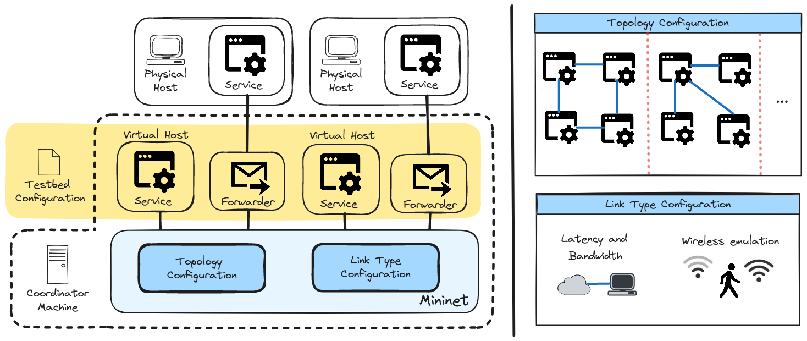
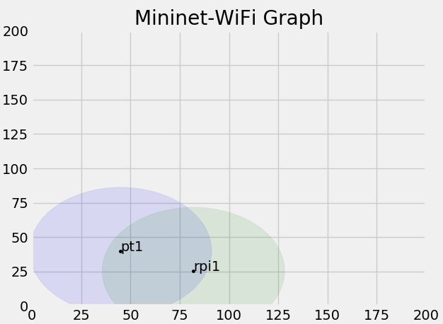

# Introduction

Modern distributed applications may consist of services which are split across different network locations, ranging from cloud, edge, to the local area network.  Ensuring that applications run smoothly over a variety of service placement configurations remains challenging because it requires physically setting up and deploying devices at different network distances.  Our testbed aims to mitigate this challenge, by enabling network simulation of different link characteristics (e.g. latency, bandwidth, mobility) for a given deployment of devices.  

## System Architecture



Let's consider an application made up of multiple services.  In our system, some hosts may be physical (meaning that these are independent physical devices providing a software service), while some may be virtual (mainly used for development when physically independent devices are not available).  **Physical hosts** communicate with other hosts via a **coordinator machine** running [Mininet](http://mininet.org/) (see setup for more information).  This intermediary coordinator allows us to alter network link characteristics in software.  

Each physical host uses a **forwarder**, which is software for forwarding IP packets between Mininet and the physical hosts.  Under the hood, these involve setting up virtual ethernet interfaces between the forwarder and Mininet nodes, and forwarding data between a physical interface (i.e. a NIC) and the virtual ethernet interface.  

Highlighted in yellow is the components which are modified by the **testbed configuration**, which are JSON files for setting up our testbed.  In addition to creating forwarders for every physical host, the testbed configuration also creates virtual hosts, as well as sets up all the necessary communication components between Mininet and virtual/physical hosts (such as virtual ethernet pairs, network namespaces for virtual hosts).  Lastly, the testbed configuration uses Mininet APIs to emulate different network topologies and link types.  

**Topology configurations** involve building an emulated network topology consisting of routers, APs, hosts, links, and switches from our testbed configuration.  In addition, **link type configurations** may specify the latency and bandwidth of different links, in addition to emulating mobility behaviors (e.g. propagation model as a device moves farther from an AP).  

# Setup

## Software Installation

Our program relies on [PcapPlusPlus](https://pcapplusplus.github.io/), and requires it to be installed.  On Linux machines, first install the [prerequisites](https://pcapplusplus.github.io/docs/install/linux):
```
sudo apt-get install libpcap-dev
```
Then, download the precompiled binaries from [here](https://github.com/seladb/PcapPlusPlus/releases/tag/v23.09), and move them into this github repo folder, such that the structure looks like this:
```
IoCT-Testbed-Simulation
|  README.md
|  ...
|--pcapplusplus/
    |--bin/
    |--example-app
```
where pcapplusplus contains all the precompiled binaries.  In our github repo, there is also an "example-app" folder, containing a main.cpp and test.sh file.  Be sure to **alter the path for "PcapPlusPlus_ROOT"** based on where you moved the precompiled binary folder.

Finally, merge the folders for example-app from this github repo and the example-app from the pcapplusplus folder.  Then, compile the example-app:
```
cd pcapplusplus/example-app
bash test.sh
```
This should compile the binary for our testbed, building the forwarder component of our architecture.


If you have physical devices that you want to use as part of the testbed, see **setup of physical devices**.  Otherwise, if you want to test out simulations only on a single device (i.e. the coordinator machine), see **setup of virtual devices**.  Mixing and matching physical and virtual devices is also possible.

## Setup of physical devices

In order to make use of our Mininet simulation, physical devices which are external to the host running the simulation must route through the host.
For example, a Raspberry Pi wanting to communicate with another Raspberry Pi via our simulation must route their traffic through our host.  This is relatively easy to do - just run the following command in each external device.
```
ip route add SUBNET via HOST_IP
```
This is assuming your devices are all sitting on the same subnet.  If your subnet is 10.0.0.0/24 and your host running Mininet is on 10.0.0.7, then this command would be:
```
ip route add 10.0.0.0/24 via 10.0.0.7
```

On your host machine, make sure your IP forwarding is turned OFF.
```
sysctl -w net.ipv4.ip_forward 
```
This should print 0 if it is turned off.

## Setup of virtual devices

When we say 'virtual devices', we really mean processes which are executed on the local machine, but appear to be an external device.  So for example, we want a python process to appear like it is in a different physical device than the current host.  This is accomplished by Linux network namespaces - basically, a virtual device is a separate network namespace, and in our case, can only interact with other devices via veth interfaces.  This allows us to avoid the issue of multiple local processes interacting directly rather than via Mininet, which is often the goal when attempting to simulate network latencies between different processes despite them residing on the same machine.

## Managing the Configurations

So the primary way we set up our experiments is via a JSON file.  You can look into the 'tests' folders to see how to set these up (e.g. tests/simple_reply_test/config_wired.json)

These JSON files allow you to dictate the behavior of the simulation without necessarily messing around with the code (e.g. you don't need to add network namespaces, set up veth devices, configure IPs).  But this requires a proper understanding of how these configurations are set up and used.


### Configuration Schema

Keywords are bolded, and descriptive information is italicized.

The general format of the config.json is as follows:

- **hosts**:
    - HOST_DEVICE_NAME: string *This is just for naming our device - please see special considerations below for naming guidance*
        - **realaddr**: string:IP_ADDRESS   *This is the ip address of the process or physical device.  In the case of physical devices, it is coincidentally the same address we will use in Mininet.  In the case of a local process (e.g. running on 127.0.0.1) you can still set this to something like 10.0.0.10 - this is because we create a separate network namespace for this process*
        - **mininetaddr**: string:IP_ADDRESS   *This is the IP address used by Mininet - usually it  matches the realaddr.*
        - **type**: string:("physical" || "virtual")          *This is the type of device, either "physical" or "virtual".  Based on this entry, the system determines what interface it listens and transmits data on.  In the case of virtual devices, we generate a separate network namespace.*
        - **connector_name**: string:CONNECTOR_NAME      *This entry determines the network behavior of messages sent across mininet.  This is determined by your 'connectors', which are just switches or APs - basically it determines what switch or AP you are connecting to based on the name you enter here*
        - **connection_type**: string:("wired" || "wireless")     *This determines how this host is connected to the AP or switch, whether it is "wired" or "wireless"*
- **connectors**:
    - CONNECTOR_NAME: string *This is just for naming our connector - same as before, please check the 'special considerations' section below.*
        - **type**: string:("AP" || "switch") *This determines what type of network connector this device is - either an Access Point or a network switch.
        - **linked_connectors**: list:\[string:CONNECTOR_NAME, ...\] *This lists out what other connectors this is connected to.  For example, you can have a switch connected to two other switches, whose names you would list in this field.
        - **link_types**: list:\[string:("wired")\] *This determines how each connector is linked to this one.  For now, all connectors are wired together, rather than wireless communication, so this field is not yet used.*
        - **link_latencies**: list:\[string:TIME\] *This determines the latency of transmitting data over each link.  TIME must be of the form 'XYZ UNIT'.  For example, "100ms".

### Other notes on configuration:
When it comes to the connectors, each link only needs to be mentioned once.  For example, if switch A is linked to switch B, we only need to describe this link in A's section (e.g. "linked_connectors":\["B"\]) without needing to repeat this in B's section.  If you repeat this, you will end up generating another link.


### Special considerations

Mininet has certain restrictions when you name your devices.  The main rules for naming your hosts and connectors are as follows:
- A name is a string followed by an integer
- Keep the name as short as you can (e.g. <5 characters total)

Failing to follow these rules will result in errors.  In particular, the latter rule is quite pernicious - it does not explicitly generate errors but it will cause problems when you attempt to create an AP and have it associate with other hosts or stations.


# Running the simulation

## Commands

```
sudo python test_mininet.py  --external_intf INTERFACE_NAME --config_file CONFIG_LOCATION
```
The --external_intf argument is the physical network interface that you are using to connect to the other external devices.  The config file stores the settings for the experiment.  For example, if your physical interface is called "enp8s0" and your config file is at "tests/mpc_test/mpc_config.json", then this command would be:
```
sudo python test_mininet.py  --external_intf enp8s0 --config_file tests/mpc_test/mpc_config.json
```

**IMPORTANT NOTE: You should rerun this test_mininet.py command anytime you make changes to the config file!**

## Mobility representations

This project heavily relies on both [Mininet](http://mininet.org/) and its wireless fork [Mininet-Wifi](https://mininet-wifi.github.io/).  These allow emulation of both wired and wireless networks.  In particular, it allows us to experiment with devices moving around in a space and associating with different APs.  When you run an experiment involving mobility (usually the '.json' configuration file will contain a 'mobility' field under one of the hosts - e.g. tests/simple_reply_test).



One of the nice features of Mininet-Wifi is that it graphs the mobility of a device over time, but also the range of its wireless signal.


## Notes on virtual hosts

When you have some processes that you wish to execute locally yet still make use of the simulated network of Mininet, you can achieve this by executing them in their corresponding network namespace.  The folder 'tests/mpc_test/mpc_config.json' gives an example configuration - it sets up two different virtual devices, vclient1 and vclient2.  The simulator also sets up two network namespaces for each virtual device (or more specifically, for every entry which has the "type"=="virtual"), and the names of each namespace is the same as the device name.  You can run python scripts in each namespace in the following way:

```
sudo ip netns exec NS_NAME python PYTHON_SCRIPT
```
where NS_NAME refers to a device name like 'vclient1' in the case of tests/mpc_test/mpc_config.json, and PYTHON_SCRIPT can be any python script that you want to use as a client/server.  For example:
```
sudo ip netns exec vclient1 python tests/simple_reply_test/external_recv.py --src_ip 10.0.0.11 --src_port 8085
```
is an example usage of one of our test scripts.


## Some quick tests

### Pre-flight checks
Firstly, if you have two external devices which are connected via the mininet host machine, then you should test to see if they communicate via this host.  These external devices should not be able to communicate if the simulation is off, and should be able to communicate once the simulation is active.  You can easily check this via ping commands.

### Simple send and receive

Once the simulation is up and running, you can quickly check communication between any two devices. First, run the following command on an external device that listens to messages (assuming you send the file there)
```
python tests/simple_reply_test/external_recv.py --src_ip IP_ADDR --src_port DESIRED_PORT
```
and run the following command on another device that sends messages
```
python tests/simple_reply_test/external_send.py --dst_ip DEST_IP_ADDR --dst_port DESIRED_PORT --src_ip IP_ADDR
```
where IP_ADDR is the physical address of the current listening device.  This should match the 'ipaddr' field in the config.json.  DEST_IP_ADDR is the ip address of the other device using external_recv.  DESIRED_PORT in both external_recv.py and external_send.py should match.

This particular example has both wired and wireless experiments, depending on the .json file you chose when running "test_mininet.py".  

### Simple HTTP access

You can also see if you can access HTTP servers via this simulation.  Assuming the same setup (two external devices), have one act as an HTTP server and another as a client.  On the server, you should run:
```
python3 -m http.server
```
And on the client, you can open a web browser to connect to that server.

### Simple SSH access

You can also see if you can ssh from one external device into another via ssh, and it should reflect some of the latency characteristics of your simulation (e.g. typing into the ssh terminal updates with a slight delay) This example, as well as the above HTTP access, is meant to show that unmodified applications can communicate via this simulation. 

### Testing with some control scenarios:

Note - the config file for this scenario assumes two virtual hosts, meaning that it runs entirely locally on your computer.

You can try out some of the code for robotic control and the impact of latency on those scenarios.  To use the code, you will need to run a few commands.  First you will need to run the mininet simulation:
```
sudo python test_mininet.py  --external_intf enp8s0 --config_file tests/mpc_test/mpc_config.json
```
Then you should run the 'server' code to begin waiting for input:
```
cd tests/mpc_test
sudo ip netns exec vclient1 python mpc_socket_lc_cloud.py
```

Then you should run the 'client' code to send input and log results:
```
cd tests/mpc_test
sudo ip netns exec vclient2 python start_script_socket.py
```


# Quick Issues

## For some reason, I'm getting multiple 'copies' of a message between two external devices!

It's likely that your system still have IPv4 forwarding turned on.  Make sure it is turned off.  Normally, this is automatically handled in our simulation but sometimes another privileged process may turn it back on.

## Attempting to start the simulation causes some error like "Error creating interface pair"

This just means Mininet did not exit properly, so it needs to be cleaned up:
```
sudo mn -c
```

## For my mobility experiments, it doesn't look like any data is being sent through the network!

This could involve several things - here, a sniffing tool like Wireshark helps tremendously.  When using mobility experiments, you should be checking the AP's wlan interface to see if it receiving data or if it is associating properly with your hosts/stations.  If it is, you should see an additional interface in your root network namespace (just run 'ifconfig') similar to the following name: 'ap1-wlan1.sta1'.  This is a special interface - the '.sta1' only gets added if the AP has successfully associated with the station.


